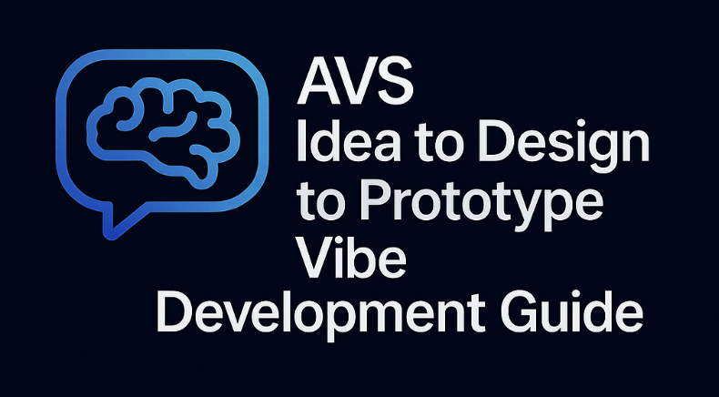

<div align="center">

</div>


# AVS Idea to Design to Prototype Vibe Development Guide

## Overview 
**Why**: this guide is meant to enable the user to go from a raw AVS Idea to Design to Prototype (Code) in under 10 mins and learn more about how EigenLayer works along the way.

**Who**: this guide is written to serve a more technical developer audience that prefers [Vibe Coding](https://x.com/karpathy/status/1886192184808149383?lang=en) with popular AI / LLM tools such as [Claude Code](https://docs.anthropic.com/en/docs/agents-and-tools/claude-code/overview). Please note that EigenLayer is also working to release a web app experience to enable the same Idea to Prototype flow which will be released independently.

**Pre-requisites**:

* High level understanding of [EigenLayer protocol](https://docs.eigenlayer.xyz/eigenlayer/overview), [Autonomously Verifiable Services](https://docs.eigenlayer.xyz/developers/Concepts/avs-developer-guide), and how building an AVS might add value to your Web3 project.   
* Any high level idea you have for an AVS.  
* [Claude Code](https://docs.anthropic.com/en/docs/agents-and-tools/claude-code/overview) installed on your machine.

**Caveats:**
- Including Claude Code and Hello-World-AVS in order to deliver a useful MVP
- Excluding Slashing functionality until the AVS Eng team is able to add this functionality to the eigenlayer-middleware / ECDSAServiceManager repo dependency for Hello World.
- For these tools, please limit your idea and designs to focus on the scope of **one [Operator Set](https://docs.eigenlayer.xyz/eigenlayer/concepts/operator-sets/operator-sets-concept)** at at time.
- The files under the `context` folder will soon be replaced with an MCP server.

# Instructions

## Stage 1: Idea Refinement

This stage is focused on taking your high level idea for building an AVS and turning it into a refined idea prompt. This will help reaffirm that your idea can be practically built as an AVS and result in a prompt that will be easy for the LLM to convert into a full AVS Design tech spec.

Steps to refine your idea:

1. Open a new terminal session.  
2. `git clone` a local copy of this repo and `cd` into the newly created `avs-vibe-developer-guide` folder.  
3. Run the `claude` command to enter the Claude Code console. Run `init` command to initialize the repository for Claude Code.  
4. Send the following prompt to Claude Code terminal to refine your idea and include any detail you wish to provide about your AVS.

```markdown
Help me generate a refined idea prompt for my AVS idea using the attached prompts/stage1-idea-refinement-prompt.md file for guidance.

My idea for an AVS is: [insert your idea here].
```

Please note that you may also add any AVS design detail you may already have in mind, including the following context to your prompt:

* Project Overview: what is the name of your project and what value does it provide for its users?  
* AVS Purpose: what benefit does the AVS provide to securing, validating or decentralizing your project.  
* Name: what do you want to name your AVS? Or do you want the LLM to name it for you 😉?  
* Operator Work: which core work or task will the Operators that comprise your AVS do?  
* Validation: The work is validated through [todo - insert a description of your validation logic at a high level]  
* Rewards: send Rewards distributions to Operators based on [todo]

5. The LLM will respond with either feedback on how to improve your AVS idea or a "[avs-name]-refined-idea-prompt.md" for your review.

## Stage 2: Design (Tech Spec) Generation

Steps to generate your Design Tech Spec:

1. Go to your open `claude` terminal session.  
2. Send the following prompt to Claude Code terminal:

```markdown
Help me generate a design tech spec for my using the attached [myavs-refined-idea-prompt.md] file and prompts/stage2-design-generation-prompt.md file for guidance.
```

3. The LLM will respond with a completed "[avs name]-design-tech-spec.md" file for your review.

## Stage 3: Prototype (Code) Generation

Steps to generate your prototype AVS code:

1. Go to your open `claude` terminal session.  
2. Send the following prompt to Claude Code terminal:

```markdown
Help me generate a prototype implementation for my AVS using the attached [my-avs]-design-tech-spec.md file and prompts/stage3-prototype-code-generation-prompt.md file for guidance.
```

3. The LLM will respond with a prototype built in the "hello-[avs name]-world" folder for your review.


# Appendix

## Repo Overview

The `/prompts` folder includes refined prompts to guide the LLM at each stage in content generation for [AVS](https://docs.eigenlayer.xyz/developers/Concepts/avs-developer-guide) idea, design and prototype (code) generation. 

The `/context` folder includes a collection of content that is helpful to add selective context to the LLM. These assets serve as a simple mechanism to enrich the LLM context window with the right information for a given prompt. These are a simpler, low-tech alternative to integrating an MCP server (which we will probably also build at a later stage).

## Testing

In order to continuously improve the AVS prompts in this repository, we will continue to add new example AVSs in the [test](/test/) folder. We will regenerate these AVSs from Idea to Design to Prototype to measure our improvements of the prompts at each stage.

## Roadmap

1. Enhance our default prompts for each stage. The initial prompts are minimally viable and can easily be improved with more time and iteration.  
2. Design: add automated logo generation and architecture design to the design generation step.  
3. The Prototype code generation phase is focused on [hello-world-avs](https://github.com/Layr-Labs/hello-world-avs) as the target codebase. We will expand this to other examples and partner platforms in the future.  
4. Add a standard front end to the hello-world-avs repo to enable better demo'ing of the solution (pull from [this example](https://x.com/weswfloyd/status/1908267994033353206)).
5. Add Slashing after it has been launched and fully integrated with eigenlayer-middleware/ECDSAServiceManager and hello-world-avs.


## Inspiration

Inspired by [community support for Claude Code](https://x.com/dabit3/status/1909246687329087550) and [these experiments](https://github.com/wesfloyd/avs-context-prompt?tab=readme-ov-file#eigenlayer-avs-idea-to-prototype-pipeline).
