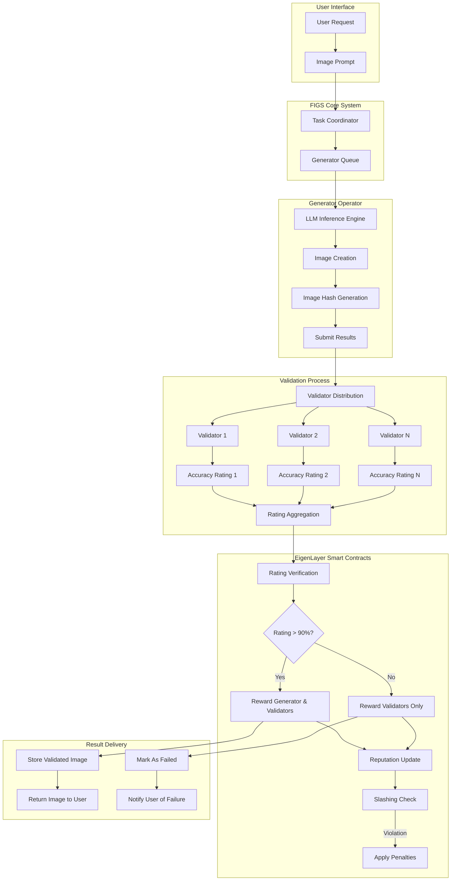

# FIGS Design Technical Specification

```
  /\_/\  
 ( o.o ) FIGS - Feline Image Generation Service
  > ^ <  
```

## 1. AVS Purpose and Scope

FIGS (Feline Image Generation Service) is designed to provide a decentralized, trustworthy source of high-quality cat images generated through LLM inference. The service addresses the need for verified, appropriate cat imagery that can be used across various applications including NFTs, web design, social media, and entertainment platforms.

This AVS adds value through:
- **Quality Assurance**: Ensuring generated images meet a high standard through decentralized validation
- **Inappropriate Content Prevention**: Multiple validators confirm the appropriateness of content
- **Decentralized Trust**: No single entity controls the validation process, creating a trust-minimized system
- **Economic Security**: Leveraging EigenLayer's restaked ETH to secure the validation process

## 2. Designing the Operator "Work" (aka task)

### Generator Operator Task Definition
- **Task Type**: The Generator Operator runs LLM inference to produce cat images based on user prompts
- **Computation Requirements**: 
  - Operate a high-performance LLM capable of image generation
  - Process user prompts into appropriate generation parameters
  - Generate cat images at a minimum resolution of 512x512 pixels
  - Support various cat styles, poses, and backgrounds as specified in prompts

### Validator Operator Task Definition
- **Task Type**: Validator Operators run separate LLM models to assess generated images
- **Computation Requirements**:
  - Operate LLM models specifically fine-tuned for image quality assessment
  - Analyze images for adherence to cat characteristics
  - Detect inappropriate content
  - Assess image quality metrics (resolution, clarity, composition)
  - Generate a numerical accuracy rating between 0% and 100%

### Input and Output

#### Generator Input:
- User prompt in text format (e.g., "orange tabby cat sitting in a garden")
- Additional parameters (optional): style preference, image size, special characteristics

#### Generator Output:
- Cat image in standard format (PNG/JPG)
- Image metadata including generation parameters
- Hash of the generated image for on-chain verification

#### Validator Input:
- Generated cat image from Generator Operator
- Original user prompt and parameters
- Assessment criteria specification

#### Validator Output:
- Numerical accuracy rating (0-100%)
- Breakdown of rating components (quality, cat-likeness, appropriateness, uniqueness)
- Brief explanation of rating decision
- Signed rating attestation for on-chain submission

## 3. Decentralized Validation

### Validation Mechanism
1. **Submission Phase**: 
   - Generator Operator produces a cat image based on user prompt
   - Image hash and metadata are submitted on-chain
   - Full image is distributed off-chain to Validator Operators

2. **Assessment Phase**:
   - Each Validator Operator independently analyzes the image using their LLM models
   - Validators assess four key criteria:
     - Image quality (25% weight)
     - Adherence to cat characteristics (35% weight)
     - Absence of inappropriate content (30% weight)
     - Uniqueness (10% weight)
   - Each validator produces a percentage score and submits their signed attestation on-chain

3. **Aggregation Phase**:
   - The AVS smart contract calculates the average accuracy rating from all validators
   - A minimum of two validator responses are required for quorum
   - The final accuracy rating is published on-chain

### Consensus Rules
- **Threshold Rule**: The image is considered successfully validated if the average accuracy rating exceeds 90%
- **Dispute Resolution**: 
  - If validator ratings show a high standard deviation (>20%), additional validators are requested to assess the image
  - In case of suspected collusion, a challenge period of 24 hours allows other validators to flag suspicious ratings
  - Extreme outlier ratings (beyond 3σ from the mean) may be excluded from the final calculation

## 4. Rewards Distribution for Successful Behaviors

### Reward Conditions
- **Validator Operators**:
  - Receive rewards for each completed validation regardless of their provided rating
  - Must submit ratings within the required timeframe (5 minutes for standard images)
  - Must provide complete assessment with breakdown of all required criteria
  - Ratings must be accompanied by valid cryptographic signatures

- **Generator Operator**:
  - Receives rewards only when the average validator accuracy rating exceeds 90%
  - Must respond to generation requests within the required timeframe (30 seconds)
  - Must produce unique images that haven't been generated before (checked via perceptual hashing)

### Payment Mechanism
- Rewards are calculated and distributed on a weekly epoch basis
- For Validator Operators: Base reward of X tokens per validation + Y% of total service fees
- For Generator Operator: Base reward of Z tokens per successful generation (>90% rating) + W% of service fees
- Token rewards are claimed via the EigenLayer rewards contract
- All payments are processed automatically at the end of each epoch

## 5. Penalties for Malicious Behaviors

### Malicious Activity Definition

#### Generator Operator Violations:
- Producing inappropriate content (average validator rating <50%)
- Generating duplicate or plagiarized images
- Consistent failure to meet quality threshold (>90%)
- Failure to respond to requests within required timeframe
- Submitting falsified metadata

#### Validator Operator Violations:
- Consistently providing outlier ratings (significantly divergent from other validators)
- Collusion with other validators to manipulate ratings
- Failing to provide complete assessments with all required criteria
- Missing validation deadlines repeatedly
- Submitting identical ratings across multiple different images

### Punitive Actions

#### Reward Withholding
- Validators who fail to submit ratings within the required timeframe forfeit rewards for that validation
- Generator Operator receives no rewards for images rated below the 90% threshold
- Validators submitting incomplete assessments forfeit 50% of rewards for that validation

#### Operator Ejection
- Generator Operator consistently producing low-quality or inappropriate content (>5 instances in a 30-day period) is removed from the generator role
- Validators consistently providing outlier ratings (>10 instances in a 30-day period) are ejected from the validator set
- Operators failing to maintain minimum hardware requirements are temporarily suspended until compliance is demonstrated

#### Slashing
- **Moderate Violations**: 
  - Consistent quality failures: 5% of staked amount
  - Repeated missed deadlines: 2% of staked amount
  - Incomplete submissions: 1% of staked amount

- **Severe Violations**:
  - Generating or approving explicitly inappropriate content: 20% of staked amount
  - Proven collusion among validators: 15% of staked amount
  - Plagiarism or copyright infringement: 10% of staked amount

- **Critical Violations**:
  - Running malicious code: 50% of staked amount
  - Identity spoofing: 30% of staked amount
  - Deliberate system attacks: Up to 100% of staked amount

---

## Appendix: Technical Implementation Diagram

