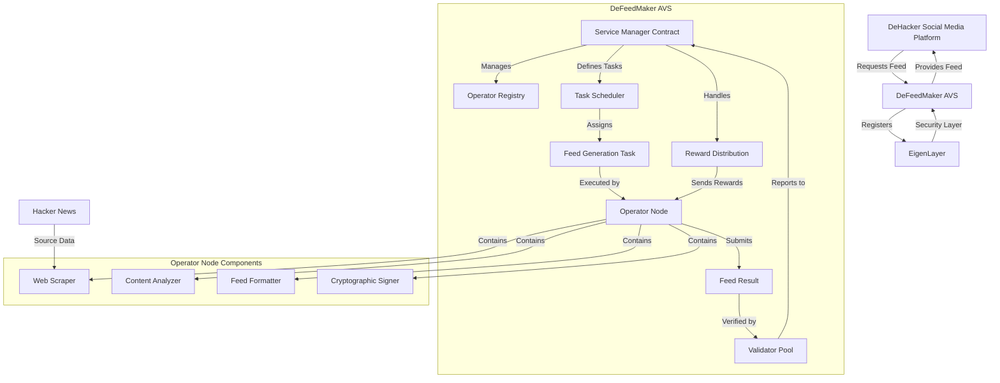

# DeFeedMaker Design Tech Spec

```
    ____       ______          __  ___      __            
   / __ \___  / ____/__  ___  / /_/   |    / /_____  _____
  / / / / _ \/ /_  / _ \/ _ \/ __/ /| |   / //_/ _ \/ ___/
 / /_/ /  __/ __/ /  __/  __/ /_/ ___ |  / ,< /  __/ /    
/_____/\___/_/    \___/\___/\__/_/  |_| /_/|_|\___/_/     
                                                          
```

## 1. AVS Purpose and Scope

DeFeedMaker is designed to provide a decentralized news aggregation service for DeHacker, a decentralized social media platform. The AVS solves the challenge of content curation and aggregation without relying on centralized algorithms or content gatekeepers.

By leveraging EigenLayer's security infrastructure, DeFeedMaker adds value to DeHacker by:
- Ensuring that news feed generation remains trustless and censorship-resistant
- Providing transparent content curation based on community-defined criteria
- Maintaining the decentralized ethos of the parent platform
- Creating accountable and verifiable content aggregation processes

## 2. Designing the Operator "Work" (aka task)

### Operator Task Definition

Operators in the DeFeedMaker AVS will perform the following computation:

1. Execute web scraping routines on Hacker News (https://news.ycombinator.com/) to collect the latest posts
2. Process and filter these posts using predefined algorithms to:
   - Identify web3-related content through keyword and topic analysis
   - Rank content based on relevance scores and engagement metrics
   - Organize posts into categories for better user experience
3. Create a structured feed that includes:
   - Post titles and summaries
   - Original URLs and source attribution
   - Relevance scores and categorization
   - Timestamp of collection

### Input and Output

**Input:**
- Timestamp range for content collection
- Configuration parameters:
  - Minimum web3 relevance threshold (0-100)
  - Maximum number of posts to include (10-50)
  - Category weightings
  - Hacker News sections to prioritize

**Output:**
- JSON-formatted feed containing:
  ```json
  {
    "feed_id": "unique-identifier",
    "timestamp": "ISO-8601-timestamp",
    "operator_address": "0x...",
    "posts": [
      {
        "title": "Post title",
        "url": "https://original-source.com/post",
        "hn_id": "hacker-news-id",
        "relevance_score": 85,
        "category": "defi",
        "summary": "Brief post summary",
        "collected_at": "ISO-8601-timestamp"
      },
      ...
    ],
    "metadata": {
      "total_posts_scanned": 200,
      "web3_threshold_used": 75,
      "categories_distribution": {
        "defi": 0.4,
        "smart_contracts": 0.3,
        "nft": 0.1,
        "dao": 0.2
      }
    },
    "signature": "cryptographic-signature"
  }
  ```

## 3. Decentralized Validation

### Validation Mechanism

Multiple validators will verify operator work through the following process:

1. **Independent Verification**:
   - Validators independently scrape the same Hacker News content using the same timestamp range
   - Each validator applies the standardized filtering and ranking algorithm
   - Results are compared against the operator's submitted feed

2. **Consistency Checks**:
   - Verify that all claimed posts exist on Hacker News
   - Confirm all URLs and references are accurate
   - Ensure relevance scores are calculated according to the defined algorithm
   - Validate that the web3 filtering criteria were correctly applied

3. **Cryptographic Verification**:
   - Confirm operator-provided signature is valid
   - Verify data integrity through hash validation

### Consensus Rules

DeFeedMaker will employ a threshold consensus model:

1. Each validator independently produces a validity score (0-100) for the operator's feed
2. Feeds require a minimum of 80% of validators to assign a validity score of 70 or higher
3. Disputed feeds enter a challenge period where:
   - Validators who identified discrepancies submit proof of the inconsistency
   - The operator has a time window to provide counter-evidence
   - The final decision is made based on on-chain verification of evidence

## 4. Rewards Distribution for Successful Behaviors

### Reward Conditions

Operators earn rewards when:
1. Their feed passes validation by the required validator threshold
2. The feed is delivered within the required time window (every 6 hours)
3. The feed maintains minimum quality standards:
   - At least 90% of posts have accurate references
   - Web3 relevance filtering meets accuracy targets
   - No evidence of manipulation or censorship is found

### Payment Mechanism

DeFeedMaker will distribute rewards as follows:

1. **Base Reward**: Fixed amount distributed every 24 hours (4 feed cycles) for operators who successfully deliver all required feeds
2. **Quality Bonus**: Additional 10-30% based on the average validity score assigned by validators
3. **User Engagement Bonus**: Additional reward based on user interactions with the feed (clicks, shares, comments)
4. **Distribution Schedule**:
   - Rewards calculated on a 24-hour basis
   - Paid out weekly to reduce gas costs
   - Distributed through an on-chain smart contract with transparent calculation

## 5. Penalties for Malicious Behaviors

### Malicious Activity Definition

Operators will be considered malicious in the following scenarios:

1. **Feed Manipulation**:
   - Including non-existent posts
   - Deliberate misrepresentation of content
   - Artificial boosting of specific content without merit

2. **Service Failures**:
   - Consistently missing feed delivery deadlines
   - Providing empty or incomplete feeds
   - Submitting identical feeds across multiple cycles without updates

3. **Gaming Attempts**:
   - Manipulating relevance scores to promote specific content
   - Colluding with other operators to standardize on incorrect feeds
   - Attempting to undermine the validation process

### Punitive Actions

Malicious operators will face a tiered response system:

1. **Warning**: For first-time, minor violations with reward reduction
2. **Reward Withholding**: Complete forfeiture of rewards for the affected period
3. **Operator Ejection**:
   - Three strikes system for repeated violations
   - Immediate ejection for severe manipulation
   - Cooldown period before re-registration is permitted
4. **Reputation Impact**:
   - On-chain record of violations accessible to other AVS services
   - Progressive penalty multipliers for repeat offenders

## Appendix: Technical Implementation

